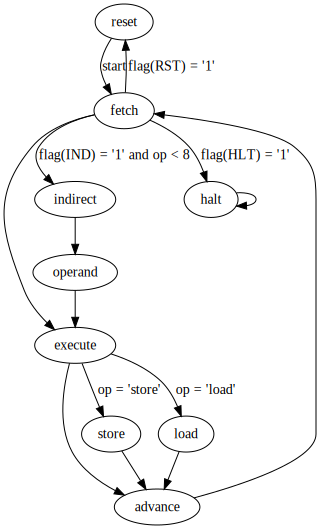

		                           ____   ___  ____  _  _                                     
		                          (  _ \ / __)(  _ \/ )( \                                    
		                           ) _ (( (__  ) __/) \/ (                                    
		                          (____/ \___)(__)  \____/                                    
		  __     ____  __  ____    ____  ____  ____  __   __   __       ___  ____  _  _       
		 / _\   (  _ \(  )(_  _)  / ___)(  __)(  _ \(  ) / _\ (  )     / __)(  _ \/ )( \      
		/    \   ) _ ( )(   )(    \___ \ ) _)  )   / )( /    \/ (_/\  ( (__  ) __/) \/ (      
		\_/\_/  (____/(__) (__)   (____/(____)(__\_)(__)\_/\_/\____/   \___)(__)  \____/

| Project   | Bit-Serial CPU in VHDL                 |
| --------- | -------------------------------------- |
| Author    | Richard James Howe                     |
| Copyright | 2019 Richard James Howe                |
| License   | MIT                                    |
| Email     | howe.r.j.89@gmail.com                  |
| Website   | <https://github.com/howerj/bit-serial> |

*Processing data one bit at a time, since 2019*.

# Introduction

This is a project for a [bit-serial CPU][], which is a CPU that has an architecture
which processes a single bit at a time instead of in parallel like a normal
CPU. This allows the CPU itself to be a lot smaller, the penalty is that it is
a lot slower. The CPU itself is called *bcpu*.

The CPU is incredibly basic, lacking support for features required to support
higher level programming (such as function calls). Instead such features can 
be emulated if they are needed. If such features are needed, or faster
throughput (whilst still remaining quite small) other [Soft-Core][] CPUs are
available, such as the [H2][]. 

To build the assembler and C based simulator for the project, you will need a C
compiler and 'make'. To build the [VHDL][] simulator, you will need [GHDL][]
installed.

The target [FPGA][] that the system is built for is a [Spartan-6][], for a
[Nexys 3][] development board. [Xilinx ISE 14.7][] was used to build the
project.

The following 'make' targets are available:

	make

By default the [VHDL][] test bench is built and simulated in [GHDL][]. This
requires that the assembler is build, to assemble the test program [bit.asm][]
into a file readable by the simulator.

	make run

This target builds the C based simulator/assembler, assembles the test program
and runs the simulator on the assembled program.

	make simulation synthesis implementation bitfile

This builds the project for the [FPGA][].

	make upload

This uploads the project to the [Nexys 3][] board. This requires that
'djtgcfg' is installed, which is a tool provided by [Digilent][].

	make documentation

This turns this 'readme.md' file into a HTML file.

	make clean

Cleans up the project.

# Use Case

Often in an [FPGA][] design there is spare Dual Port Block RAM (BRAM) available,
either because only part of the BRAM module is being used or because it is not
needed entirely. Adding a new CPU however is a bigger decision than using spare
BRAM capacity, it can take up quite a lot of floor space, and perhaps other
precious resources. If this is the case then adding this CPU costs practically
nothing in terms of floor space, the main cost will be in development time.

In short, the project may be useful if:

* Space is at a premium in your design.
* You have spare memory for the program and storage.
* You need a programmable CPU that supports a reasonable instruction set.
* *Execution speed is not a concern*.

# Other Soft Microprocessors

This is a *very* specialized core, that cannot be emphasized enough. It
executes slowly, but is small. Other, larger core (but still relatively small)
may be useful for your needs. In terms of engineering trade offs this design
takes things to the extreme in one direction only.

The core should be written to be portable to different [FPGA][]s, however the
author only tests what they have available (Xilinx, Spartan-6).

## The H2

Another small core, based on the J1. This core executes quite quickly and uses
few resources, although much more than this core. The instruction set is quite
dense and allows for higher level programming than just using straight
assembler.

* <https://github.com/howerj/forth-cpu>

## Other cores

* <https://en.wikipedia.org/wiki/Soft_microprocessor>

# CPU Specification

A quick overview of the features *bcpu*:

* A 16/12-bit CPU
* Can address 4096 16-bit values of program memory, and 8192 16-byte values
(including the 4096 16-bit values of program memory) of data and
memory mapped input/output.
* An accumulator design
* As it is a [bit-serial CPU][] it processes data a bit at a time, the
processor stays in each state for 16 clock cycles. A single instruction is
fetched and executed in 51-68 ((16 + 1)\*3 to (16 + 1) \* 5) clock cycles.
* Has add-with-carry, rotate and shift left/right instructions.
* Lacks any kind of call stack, or registers.
* Has very little CPU state; 5 x 16 bit registers, a 4-bit register, 2 x 3-bit
  register, and 2 x 1-bit register.
* Takes up very little floor space and no dedicated resources (apart from a
Block RAM for the program memory) on the [FPGA][].

The CPU is self-contained within a single file, [bit.vhd][]. It communicates to
the rest of the system in the [FPGA][] via a serial interface. Whilst the CPU
can be customized via a [VHDL][] generic to be of an arbitrary width, the rest
of the document and the toolchain assume the width has been set to 16. 

There is a single state-machine which forms the heart of the CPU, it has seven
states; 'reset', 'fetch', 'execute', 'store', 'load', 'advance' and 'halt'.

Not shown in this diagram is the fact that all states can go back to the
'reset' state when an external reset signal is given, this reset can be
configured to be asynchronous or synchronous.

Whilst the CPU could be described as a 16-bit CPU, a more accurate description
would be that it is a hybrid 16/12-bit CPU. All instructions are composed of a
4-bit command and a 12-bit operand (even if the operand is not used).

# Instruction Set

Register Key:

* acc   - The accumulator, this is used to store the results of operations,
such as addition, or loading a value.
* pc    - The program counter, this is incremented after each instruction
is executed unless the instruction sets the program counter.
* flags - A 16-bit register containing 8-flags
* op    - A 12-bit operand which is part of every instruction.
* rotl  - rotate left, not through carry
* rotr  - rotate right, not through carry
* &lt;&lt; - shift left, not through carry
* &gt;&gt; - shift right, not through carry
* bitcount - a function returning the count of the number of set bits in a
value
* memory - the program and data memory, read/write.

The instruction set is as follows, opcode is the top four bits of every
instruction, the rest is used as a 12-bit immediate value which could be used
as a value or an address.

| Instruction | Registers / Flags Effected               | Description                       | Affected by INDIRECT Flag |
| ----------- | ---------------------------------------- | --------------------------------- | ------------------------- |
|   or        | acc = acc OR op                          | OR  with 12-bit immediate value   | Yes                       |
|   and       | acc = acc AND (op OR $F000) \*           | AND with 12-bit immediate value   | Yes                       |
|   xor       | acc = acc XOR op                         | XOR with 12-bit immediate value   | Yes                       |
|   add       | acc = acc + op + carry                   | Add with 12-bit immediate value,  | Yes                       |
|             | carry = set/clr                          | Carry added in and set.           |                           |
|   lshift    | if alternate flag set:                   | Left rotate *OR* Left Shift by    | Yes                       |
|             | acc = rotl(acc, bitcount(op)             | bit-count of 12-bit operand.      |                           |
|             | else                                     | Rotate/Shift selected by CPU flag |                           |
|             | acc = acc &lt;&lt; bitcount(op)          |                                   |                           |
|   rshift    | if alternate flag set:                   | Right rotate *OR* Right Shift by  | Yes                       |
|             | acc = rotr(acc, bitcount(op)             | bit-count of 12-bit operand.      |                           |
|             | else                                     | Rotate/Shift selected by CPU flag |                           |
|             | acc = acc &gt;&gt; bitcount(op)          |                                   |                           |
|   load      | acc = memory(op)                         | Load memory location              | Yes                       |
|   store     | memory(op) = acc                         | Store to memory location          | Yes                       |
|   in        | acc = io(op)                             | Load input memory location        |                           |
|   out       | io(op) = acc                             | Store to output memory location   |                           |
|   literal   | acc = op                                 | Load literal                      |                           |
|   Reserved  |                                          |                                   |                           |
|   jump      | pc = op                                  | Unconditional Jump to 12-bit      |                           |
|             |                                          | Address                           |                           |
|   jumpz     | if zero flag not set then:               | Conditional Jump, set Program     |                           |
|             | pc = op                                  | Counter to 12-bit address only if |                           |
|             |                                          | accumulator is non-zero           |                           |
|   set       | if (op & 1) flags = acc else pc = acc    | Set a register directly           |                           |
|   get       | if (op & 1) acc = flags else acc = pc    | Get contents of a register        |                           |

If the command is affected by the INDIRECT flag then when the bit is set the
processor loads the value stored in the location specified by the operand
instead of using the operand directly. Also of note, if the indirect flag is
on then the 'AND' instruction does not 'OR' '$F000' with the operand before
the 'AND', it just uses the value loaded out of memory.

The flags register contains the following flags:

| Flag-Bit | Name        | Description                    |
| -------- | ----------- | ------------------------------ |
|    0     | carry       | Carry Flag                     |
|    1     | zero        | Is accumulator zero?           |
|    2     | negative    | Is accumulator negative?       |
|    3     | Parity      | Parity of accumulator          |
|    4     | Alternate   | Activate alternate instruction |
|    5     | Reset       | Set to reset the CPU           |
|    6     | Indirect    | Load operation location        |
|    7     | Halt        | Set to halt the CPU            |
|   8-15   | Reserved    |                                |

The zero, parity and negative flags are updated before each instruction is
executed and depend only on the contents on the accumulator. They are updated
regardless of what instruction is executed. The carry flag is only updated by
addition, or the flags instruction, and the borrow flag only by subtraction or
the flag instruction. The flags instruction can set the zero, parity or
negative flag bits, however they will be updated right after the flags
instruction has been executed.

The Halt flag takes precedence over the Reset flag. The reset instruction
clears all of the flags, then recalculates the parity, zero and negative flags.

To connect the CPU up to the rest of the system you will need to understand the
signal timing for all of the *bcpu* input and output signals:

 

Some notes on the timing diagram, the 'cycle' field is for illustrative
purposes only. The text in the 'cycle' field has the following meaning:

* prev: The last bit of the previous execution state.
* init: The first bit of the current execution state, this is used to set up
  the current execution state.
* 0-15: The rest of the bits to be processed for the current execution state.
* next: The first bit of the next execution state.
* rest: The rest of the bits of the next execution states.

Other useful information:

* The Least Significant Bit is transmitted first input, output and the address.
* The output signal line goes to either an output register or an address
register depending on whether 'oe' or 'ae' is selected.
* Reads and writes never happen at the same time.
* All of the enable lines ('oe', 'ie', and 'ae') are held high for exactly
16-clock cycles. Prior to this, and after it, the line are guaranteed to return
to zero for at least one clock cycle. 

# Tool-Chain

The tool-chain is entirely contained within a single file, [bit.c][]. This
contains a simulator/debugger and an assembler for the CPU. It is capable of
producing files understandable by the [VHDL][] CPU as well, the generated file
is used for the [C][] simulation and the [VHDL][] simulation/synthesis.

The syntax of the assembler and the directives it provides are quite primitive.
The program itself is quite small (about 500 LOC), so you can read it to
understand it and extend it yourself if you need to.

The directives and commands can be split up into three groups, based on the
number of arguments they comprise; one, two or three. Only one command may be
placed on a single line. Comments begin with '#' or a ';' and continue until
the end of a line. A line is limited to 256 characters in length. All numbers
are entered in hexadecimal, numbers can instead be replaced by references
either a label or a variable. Forward references are allowed.

Directives:

| Directive              | Description                               |
| ---------------------- | ----------------------------------------- |
| i                      | Write address as a literal into memory at |
|                        | current location.                         |
| $                      | Write number as a literal into memory at  |
|                        | current location.                         |
| .variable i            | Allocate space for a variable and give    |
|                        | it a name                                 |
| .allocate $            | Allocate space                            |
| .set $i $i             | Set label or location to value            |
| .label i               | Create label at current location          |
| .instruction           | Compile instruction                       |
| .instruction $i        | Compile instruction with operand          |
| .macro i               | Begin a macro definition                  |
| .end                   | End a macro definition                    |
| .include i             | Include a file                            |
| .address               |                                           |
| #                      | Comment until end of line                 |
| ;                      | Comment until end of line                 |

The arguments given to the directives in the above table can either be
hexadecimal numbers (such as '$123' or $a12'). This is shown with a '$' sign.
Or they can be a label or a variable, which is shown with a 'i' sign.

The instruction field may be one of the following; "or", "and", "xor", "invert",
"add", lshift", "rshift", "load", "store", "literal", "flags", "jump", 
"jumpz", "in", "out", ""jumpi", "pc".

To assemble a file with the toolchain:

	./bit -a bit.asm bit.hex

To run the simulator on a built hex file:

	./bit -r bit.hex

# To-Do

This is more of a nice-to-have list, and a list of ideas.

* Improve and update documentation, which is now out of date given all
of the changes to the project. There are bound to be inconsistencies
and other problems.
* A good project to use this CPU for would be to reimplement the VT100 terminal
  emulator used in <https://github.com/howerj/forth-cpu>. I could perhaps
  reimplement the core, which came from <http://www.javiervalcarce.eu/html/vhdl-vga80x40-en.html>.
  Less hardware could be used, whilst the functionality could be increased. The
  CPU takes up very little room and two of the FPGA dual-port block RAM devices 
  are already required by the VGA module - one for font (of which only a
  fraction of the memory and a single port is used) and the memory required
  for the text buffer. 
* Implement a bit-banged UART as a program. Doing this (and perhaps integrating
  this with the VGA core) would mean even fewer resources would be needed.
* Add a timer peripheral into the CPU core itself so it is always available. It
  should be capable of generating interrupts for the CPU. This could be used
  so the CPU always has a baud rate counter. Three delay lines connected to
  each other could be used if a counter is too expensive, each on divides the
  clock by 2^N.

For the BCPU and its internals:
* Add an interrupt request line.
* Add interrupt handling, which will require a way of saving
the program counter somewhere. The easiest way of implementing this would
be store the current program counter in a fixed address (say '0xFFF')
whilst shifting in the current value from that same address. An interrupt
request would have to disable interrupts.
* Allow the CPU to be customized via generics, such as:
  * Type of instructions available
* Try to merge ADVANCE into one of the other states if possible,
or at least do the PC+1 in parallel with EXECUTE.
* Allow more data/IO to be addressed by using more flag bits
* Add assertions, model/specify behaviour
  - Assert output lines are correct for the appropriate states
  and instructions.
* A super minimal forth has been added (not mine) that targets the boot-sector
for a DOS box. See [r8086.zip][]. This could be used as a template for a
minimal Forth for this CPU, it would need to be larger as the instruction set
is more primitive and more would need to be implemented.

For the assembler/simulator:
- Allow the inclusion of other files with an 'include' directive
- Make the assembler smaller by rewriting it
- Rotate does not seem to work, this needs fixing

# Project Goals

* [x] Map out a viable instruction set
* [x] Make a toolchain for the system
  * [x] Make a primitive assembler
    * [x] Assemble short programs
    * [x] Add macros
    * [ ] Add an 'include' directive
    * [ ] Add a directive to compile counted strings
    * [ ] Allow macros to have parameters
    * [ ] Add conditional macros
    * [ ] Allow simple expressions to be evaluated
  * [x] Make a simulator for the system
* [x] Implement the system on an FPGA
  * [x] Implement the CPU
  * [x] Implement a memory and peripheral interface
  * [ ] Add an interrupt request mechanism
  * [ ] Add a counter that can cause an interrupt to the core
* [x] Create a tiny test program
* [x] Verify program works in hardware
* [ ] Implement a tiny Forth on the CPU
* [ ] Use in other VHDL projects
  * [ ] As a low speed UART (Bit-Banged)
  * [ ] As a VT100 interface for a VGA Text Terminal
* [ ] Keep the processor small
* [ ] Make a bit-parallel version of the CPU

# References / Appendix

The state-machine diagram was made using [Graphviz][], and can be viewed and
edited immediately by copying the following text into [GraphvizOnline][].

	digraph bcpu {
		reset -> fetch [label="start"]
		fetch -> execute
		fetch -> indirect [label="flag(IND) = '1' and op < 8"]
		fetch -> reset  [label="flag(RST) = '1'"]
		fetch -> halt  [label="flag(HLT) = '1'"]
		indirect -> operand 
		operand -> execute
		execute -> advance
		execute -> store   [label="op = 'store'"]
		execute -> load   [label="op = 'load'"]
		store -> advance
		load -> advance
		advance -> fetch
		halt -> halt
	}

For timing diagrams, use [Wavedrom][] with the following text:

	{signal: [
	  {name: 'clk',   wave: 'pp...p...p...p...p..'},
	  {name: 'cycle', wave: '22222222222222222222', data: ['prev', 'init','0', '1', '2', '3', '4', '5', '6', '7', '8', '9', '10', '11', '12', '13', '14', '15', 'next', 'rest']},
	  {name: 'cmd',   wave: 'x2..................', data: ['HALT']},
	  {name: 'ie',    wave: 'x0..................'},
	  {name: 'oe',    wave: 'x0..................'},
	  {name: 'ae',    wave: 'x0..................'},
	  {name: 'o',     wave: 'x0..................'},
	  {name: 'i',     wave: 'x...................'},
	  {name: 'halt',  wave: 'x1..................'},
	  {},
	  
	  {name: 'clk',   wave: 'pp...p...p...p...p..'},
	  {name: 'cycle', wave: '22222222222222222222', data: ['prev', 'init','0', '1', '2', '3', '4', '5', '6', '7', '8', '9', '10', '11', '12', '13', '14', '15', 'next', 'rest']},
	  {name: 'cmd',   wave: 'x2................xx', data: ['ADVANCE']},
	  {name: 'ie',    wave: 'x0.................x'},
	  {name: 'oe',    wave: 'x0.................x'},
	  {name: 'ae',    wave: 'x01...............0x'},
	  {name: 'o',     wave: 'x0================0x', data: ['0', '1', '2', '3', '4', '5', '6', '7', '8', '9', '10', '11', 'F12', 'F13', 'F14', 'F15']},
	  {name: 'i',     wave: 'x.................xx'},
	  {name: 'halt',  wave: 'x0.................x'},
	  {},
	  
	  {name: 'clk',   wave: 'pp...p...p...p...p..'},
	  {name: 'cycle', wave: '22222222222222222222', data: ['prev', 'init','0', '1', '2', '3', '4', '5', '6', '7', '8', '9', '10', '11', '12', '13', '14', '15', 'next', 'rest']},      
	  {name: 'cmd',   wave: 'x2................xx', data: ['OPERAND or LOAD']},
	  {name: 'ie',    wave: 'x01...............0x'},
	  {name: 'oe',    wave: 'x0.................x'},
	  {name: 'ae',    wave: 'x0.................x'},
	  {name: 'o',     wave: 'x0.................x'},
	  {name: 'i',     wave: 'x.================xx', data: ['0', '1', '2', '3', '4', '5', '6', '7', '8', '9', '10', '11', '12', '13', '14', '15']},
	  {name: 'halt',  wave: 'x0.................x'},
	  {}, 
	  
	  {name: 'clk',   wave: 'pp...p...p...p...p..'},
	  {name: 'cycle', wave: '22222222222222222222', data: ['prev', 'init','0', '1', '2', '3', '4', '5', '6', '7', '8', '9', '10', '11', '12', '13', '14', '15', 'next', 'rest']},
	  {name: 'cmd',   wave: 'x2................xx', data: ['STORE']},
	  {name: 'ie',    wave: 'x0.................x'},
	  {name: 'oe',    wave: 'x01...............0x'},
	  {name: 'ae',    wave: 'x0.................x'},
	  {name: 'o',     wave: 'x0================0x', data: ['0', '1', '2', '3', '4', '5', '6', '7', '8', '9', '10', '11', '12', '13', '14', '15']},
	  {name: 'i',     wave: 'x.................xx'},
	  {name: 'halt',  wave: 'x0.................x'},
	  {},
	  
	  {name: 'clk',   wave: 'pp...p...p...p...p..'},
	  {name: 'cycle', wave: '22222222222222222222', data: ['prev', 'init','0', '1', '2', '3', '4', '5', '6', '7', '8', '9', '10', '11', '12', '13', '14', '15', 'next', 'rest']},
	  {name: 'cmd',   wave: 'x2................xx', data: ['INDIRECT or EXECUTE: LOAD, STORE, JUMP, JUMPZ']},
	  {name: 'ie',    wave: 'x0.................x'},
	  {name: 'oe',    wave: 'x0.................x'},
	  {name: 'ae',    wave: 'x01...............0x'},
	  {name: 'o',     wave: 'x0================0x', data: ['0', '1', '2', '3', '4', '5', '6', '7', '8', '9', '10', '11', 'F12', 'F13', 'F14', 'F15']},
	  {name: 'i',     wave: 'x.................xx'},
	  {name: 'halt',  wave: 'x0.................x'},
	  {},
	  
	  {name: 'clk',   wave: 'pp...p...p...p...p..'},
	  {name: 'cycle', wave: '22222222222222222222', data: ['prev', 'init','0', '1', '2', '3', '4', '5', '6', '7', '8', '9', '10', '11', '12', '13', '14', '15', 'next', 'rest']},      
	  {name: 'cmd',   wave: 'x2................xx', data: ['EXECUTE: NORMAL INSTRUCTION']},
	  {name: 'ie',    wave: 'x0.................x'},
	  {name: 'oe',    wave: 'x0.................x'},
	  {name: 'ae',    wave: 'x0.................x'},
	  {name: 'o',     wave: 'x0.................x'},
	  {name: 'i',     wave: 'x.................xx'},
	  {name: 'halt',  wave: 'x0.................x'},
	  {},
	  
	  {name: 'clk',   wave: 'pp...p...p...p...p..'},
	  {name: 'cycle', wave: '22222222222222222222', data: ['prev', 'init','0', '1', '2', '3', '4', '5', '6', '7', '8', '9', '10', '11', '12', '13', '14', '15', 'next', 'rest']},
	  {name: 'cmd',   wave: 'x2................xx', data: ['FETCH']},
	  {name: 'ie',    wave: 'x01...............0x'},
	  {name: 'oe',    wave: 'x0.................x'},
	  {name: 'ae',    wave: 'x0.................x'},
	  {name: 'o',     wave: 'x0.................x'},
	  {name: 'i',     wave: 'x.================xx', data: ['0', '1', '2', '3', '4', '5', '6', '7', '8', '9', '10', '11', '12', '13', '14', '15']},
	  {name: 'halt',  wave: 'x0.................x'},
	  {},
	  
	  {name: 'clk',   wave: 'pp...p...p...p...p..'},
	  {name: 'cycle', wave: '22222222222222222222', data: ['prev', 'init','0', '1', '2', '3', '4', '5', '6', '7', '8', '9', '10', '11', '12', '13', '14', '15', 'next', 'rest']},
	  {name: 'cmd',   wave: 'x2................xx', data: ['RESET']},
	  {name: 'ie',    wave: 'x0.................x'},
	  {name: 'oe',    wave: 'x0.................x'},
	  {name: 'ae',    wave: 'x01...............0x'},
	  {name: 'o',     wave: 'x0.................x'},
	  {name: 'i',     wave: 'x.................xx'},  
	  {name: 'halt',  wave: 'x0.................x'},
	  {},
	  
	]}

That's all folks!

[H2]: https://github.com/howerj/forth-cpu
[Soft-Counter]: https://en.wikipedia.org/wiki/Soft_microprocessor#Core_comparison
[bit-serial CPU]: https://en.wikipedia.org/wiki/Bit-serial_architecture
[VHDL]: https://en.wikipedia.org/wiki/VHDL
[GHDL]: http://ghdl.free.fr/
[Graphviz]: https://graphviz.org/
[GraphvizOnline]: https://dreampuf.github.io/GraphvizOnline
[bit.vhd]: bit.vhd
[bit.c]: bit.c
[FPGA]: https://en.wikipedia.org/wiki/Field-programmable_gate_array
[Wavedrom]: https://wavedrom.com/editor.html
[Cool ASCII Text]: http://www.patorjk.com/software/taag
[Xilinx ISE 14.7]: https://www.xilinx.com/products/design-tools/ise-design-suite/ise-webpack.html
[Nexys 3]: https://store.digilentinc.com/nexys-3-spartan-6-fpga-trainer-board-limited-time-see-nexys4-ddr/
[Spartan-6]: https://www.xilinx.com/products/silicon-devices/fpga/spartan-6.html
[bit.asm]: bit.asm
[Digilent]: https://store.digilentinc.com/
[r8086.zip]: r8086.zip
[C]: https://en.wikipedia.org/wiki/C_%28programming_language%29

