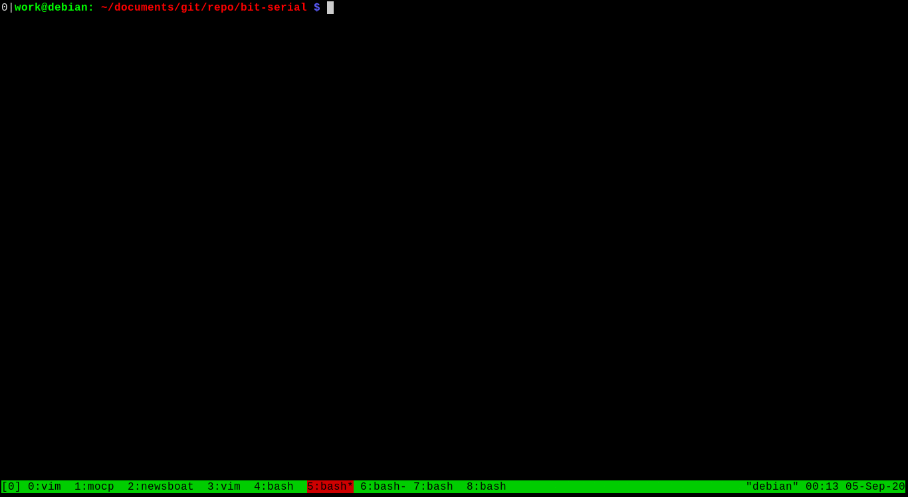
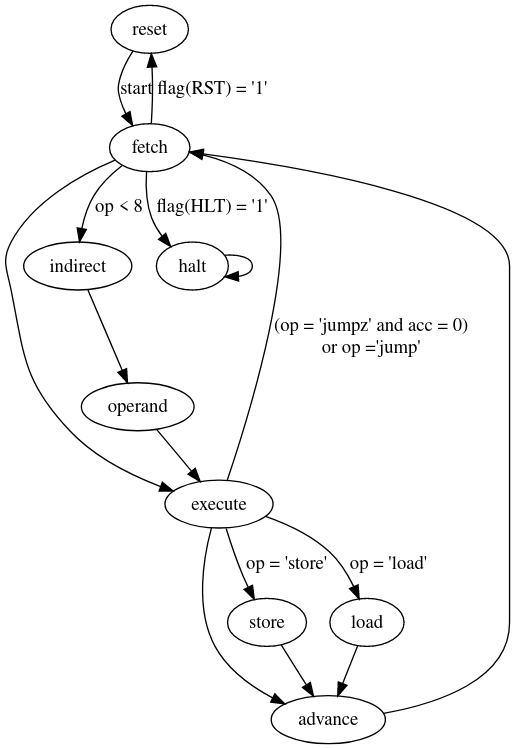
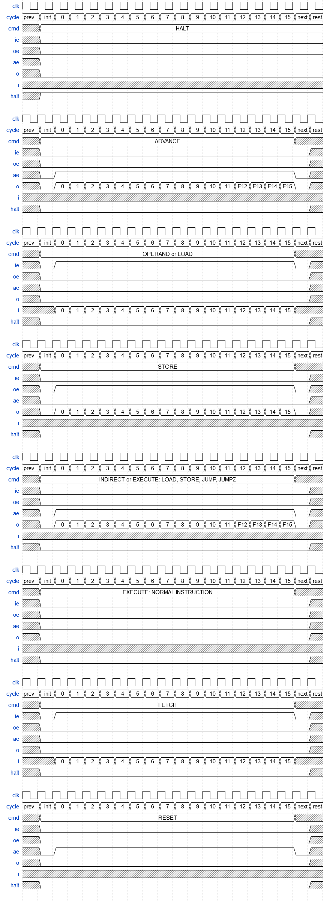

# BIT SERIAL CPU and TOOL-CHAIN

*  Project:   Bit-Serial CPU in VHDL
*  Author:    Richard James Howe
*  Copyright: 2019,2020 Richard James Howe
*  License:   MIT
*  Email:     howe.r.j.89@gmail.com
*  Website:   <https://github.com/howerj/bit-serial>

*Processing data one bit at a time, since 2019*.

# Introduction

This is a project for a [bit-serial CPU][], which is a CPU that has an architecture
which processes a single bit at a time instead of in parallel like a normal
CPU. This allows the CPU itself to be a lot smaller, the penalty is that it is
*a lot* slower. The CPU itself is called *bcpu*.

The CPU is incredibly basic, lacking features required to support
higher level programming (such as function calls). Instead such features can
be emulated if they are needed. If such features are needed, or faster
throughput (whilst still remaining quite small) other [Soft-Core][] CPUs are
available, such as the [H2][].

To build and run the C based simulator for the project, you will need a C
compiler and 'make'. To build and run the [VHDL][] simulator, you will need [GHDL][]
installed.

The cross compiler requires [gforth][], although a pre-compiled image is
provided in case you do not have access to it, called '[bit.hex][]', this hex file
contains a working [Forth][] image. To run this:

	make bit
	./bit bit.hex

An example session of the simulator running is:

You should be greeted by a [Forth][] prompt, type 'words' and hit a carriage
return to get a list of defined functions.

The target [FPGA][] that the system is built for is a [Spartan-6][], for a
[Nexys 3][] development board. [Xilinx ISE 14.7][] was used to build the
project.

The following 'make' targets are available:

	make

By default the [VHDL][] test bench is built and simulated in [GHDL][]. This
requires [gforth][] to assemble the test program [bit.fth][] into a file
readable by the simulator.

	make run

This target builds the C based simulator, assembles the test program
and runs the simulator on the assembled program.

	make synthesis implementation bitfile

This builds the project for the [FPGA][].

	make upload

This uploads the project to the [Nexys 3][] board. This requires that
'djtgcfg' is installed, which is a tool provided by [Digilent][].

	make documentation

This turns this 'readme.md' file into a HTML file.

	make clean

Cleans up the project.

# eForth

The tool-chain for the device is used to build an image for a Forth
interpreter, more specifically a Forth interpreter similar to a dialect of
Forth known as 'eForth', it differs between eForth in order to save on space
which is at a premium. You should be greeted with an eForth prompt when running
the 'make run' target that looks something like this:

	$ make run
	./bit bit.hex
	eForth 3.1

You can see all of the defined words (or functions) by typing in 'words' and
hitting return.

	$ make run
	./bit bit.hex
	eForth 3.1
	words

Arithmetic in Forth in done using Reverse Polish Notation:

	2 2 + . cr

Will print out '4'. This is not the place for a Forth tutorial, the Forth
interpreter is mainly here to demonstrate that the bit-serial CPU is working
correctly and can be used for useful purposes. No demonstration would be
complete without a 'Hello, World' program, however:

	: hello cr ." Hello, World!" ;
	hello

Go use your favorite search engine to find a Forth tutorial.

# Use Case

Often in an [FPGA][] design there is spare Dual Port Block RAM (BRAM) available,
either because only part of the BRAM module is being used or because it is not
needed entirely. Adding a new CPU however is a bigger decision than using spare
BRAM capacity, it can take up quite a lot of floor space, and perhaps other
precious resources. If this is the case then adding this CPU costs practically
nothing in terms of floor space, the main cost will be in development time.

In short, the project may be useful if:

* FPGA Floor space is at a premium in your design.
* You have spare memory for the program and storage.
* You need a programmable CPU that supports a reasonable instruction set.
* *Execution speed is not a concern*.

There were two use cases that the author had in mind when setting out to build
this system:

* As a CPU driving a low-baud UART
* As a controller for a VT100 terminal emulator that would control cursor
  position and parse escape codes, setting colors and attributes in a hardware
  based text-terminal (this was to replace an existing VHDL only system that
  had spare capacity in the FPGAs dual-port block RAMs used to store the Font
  and text).

# Tool-chain

The tool-chain consists of a cross compiler written in Forth, it itself
implements a virtual machine on top of which a Forth interpreter is written.
The accumulator machine lacks call/returns, and a stack, so these have to be
implemented. The meta-compiler (a Forth specific term for what is a
more widely known as a cross-compiler) is available in [bit.fth][].

As the instruction set is anemic and CPU features lacking it is best to target
the virtual machine and program in Forth than it is to program in assembly.

Despite the inherently slow speed of the design and the further slow down
executing code on top of a virtual machine the interpreter is plenty fast
enough for interactive use, slowing down noticeably when division has to be
performed.

# CPU Specification

The CPU is a 16-bit design, in principle a normal bit parallel CPU design could
be implemented of the same CPU, but in practice you not end up with a CPU like
this one if you remove the bit-serial restriction.

The CPU has 16 operation, each instruction consists of a 4-bit operation field
and a 12-bit operand. Depending on the CPU mode that operand and instruction
that operand can either be a literal or an address to load a 16-bit word from
(addresses are word and not byte oriented, so the lowest bit of an address
specifies the next word not byte). Only the first 8 operations can have their
operand indirected, which is deliberate.

The CPU is an accumulator machine, all instructions either modify or use the
accumulator to store operation results in them. The CPU has three registers
including the accumulator, the other two are the program counter which is
automatically incremented after each instruction excluding the jump
instructions (the SET instruction is also excluded when setting the program
counter only) and a flags register.

The instructions are:

	| ----------- | -------------------------------------- | --------------------------------- | ---------------- |
	| Instruction | C Operation                            | Description                       | Cycles           |
	| ----------- | -------------------------------------- | --------------------------------- | ---------------- |
	| OR          | acc |= lop                             | Bitwise Or                        | [3 or 5]*(N+1)   |
	| AND         | acc &= lop                             | Bitwise And                       | [3 or 5]*(N+1)   |
	| XOR         | acc ^= lop                             | Bitwise Exclusive Or              | [3 or 5]*(N+1)   |
	| ADD         | acc += lop                             | Add with carry, sets carry        | [3 or 5]*(N+1)   |
	| LSHIFT      | acc = acc << lop (or rotate left)      | Shift left or Rotate left         | [3 or 5]*(N+1)   |
	| RSHIFT      | acc = acc >> lop (or rotate right)     | Shift right or Rotate right       | [3 or 5]*(N+1)   |
	| LOAD        | acc = memory(lop)                      | Load                              | [4 or 6]*(N+1)   |
	| STORE       | memory(lop) = acc                      | Store                             | [4 or 6]*(N+1)   |
	| LOADC       | acc = memory(op)                       | Load from memory constant addr    | 4*(N+1)          |
	| STOREC      | memory(op) = acc                       | Store to memory constant addr     | 4*(N+1)          |
	| LITERAL     | acc = op                               | Load literal into accumulator     | 3*(N+1)          |
	| UNUSED      | N/A                                    | Unused instruction                | 3*(N+1)          |
	| JUMP        | pc = op                                | Unconditional Jump                | 2*(N+1)          |
	| JUMPZ       | if(!acc){pc = op }                     | Jump If Zero                      | [2 or 3]*(N+1)   |
	| SET         | if(op&1){flg=acc}else{pc=acc}          | Set Register                      | 3*(N+1)          |
	| GET         | if(op&1){acc=flg}else{acc=pc}          | Get Register                      | 3*(N+1)          |
	| ----------- | -------------------------------------- | --------------------------------- | ---------------- |

* pc    = program counter
* acc   = accumulator
* indir = indirect flag
* lop   = instruction operand if indirect flag not set, otherwise it equals to the memory
          location pointed to by the operand
* op    = instruction operand
* flg   = flags register
* N     = bit width, which is 16.

The number of cycles an instruction takes to complete depends on whether it
performs an indirection, or in the case of GET/SET it depends if it it setting
the program counter (2 cycles only) or the flags register (3 cycles), or performing
an I/O operation (4 cycles), getting the flags or program counter always costs
3 cycles.

The flags in the 'flg' register are:

	| ---- | --- | --------------------------------------- |
	| Flag | Bit | Description                             |
	| ---- | --- | --------------------------------------- |
	| Cy   |  0  | Carry flag, set by addition instruction |
	| Z    |  1  | Zero flag                               |
	| Ng   |  2  | Negative flag                           |
	| R    |  3  | Reset Flag - Resets the CPU             |
	| HLT  |  4  | Halt Flag - Stops the CPU               |
	| ---- | --- | --------------------------------------- |

* The carry flag (Cy) is set by the ADD instruction, it can also be set and cleared
with the GET/SET instructions.
* 'Z' is set whenever the accumulator is zero.
* 'Ng' is set whenever the accumulator has its highest bit set, indicating that
  the accumulator is negative.
* 'R', Reset flag, this resets the CPU immediately, only the HLT flag takes
precedence.
* 'HLT', The halt flag takes priority over everything else, sending the CPU
into a halt state.

There is really not much else to this CPU from the point of view of a user of
this core, integrating this core into another system is more complicated
however, you will need to be far more aware of timing of signals and their
enable lines. Much like the processor, a single bit bus in conjunction with an
enable is used to communicate with the outside world.

The internal state of the CPU is minimal, to make a working system the memory
and I/O controller will need (shift) registers to store the address and
input/output.

The CPU state-machine is:

And the CPU bus timing diagram:

# Peripherals

The system has a minimal set of peripherals; a bank of switches with LEDs next
to each switch and a UART capable of transmission and reception, other
peripherals could be added as needed.

## Register Map

The I/O register map for the device is very small as there are very few
peripherals.

	| ------- | -------------- |
	| Address | Name           |
	| ------- | -------------- |
	| 0x4000  | LED/Switches   |
	| 0x4001  | UART TX/RX     |
	| 0x4002  | UART Clock TX* |
	| 0x4003  | UART Clock RX* |
	| 0x4004  | UART Control*  |
	| ------- | -------------- |
	These registers are turned off by default
	and will need to be enabled during synthesis.

* LED/Switches

A bank of switches, non-debounced, with LED lights next to them.

	+---------------------------------------------------------------+
	| F | E | D | C | B | A | 9 | 8 | 7 | 6 | 5 | 4 | 3 | 2 | 1 | 0 |
	+---------------------------------------------------------------+
	|                           |   Switches 1 = on, 0 = off        | READ
	+---------------------------------------------------------------+
	|                           |   LED 1 = on, 0 = off             | WRITE
	+---------------------------------------------------------------+

* UART TX/RX

The UART TX/RX register is used to read and write data bytes to the UART and
check on the UART status. The UART has a FIFO that is used to capture the
results of the UART. The usage of which is non-optional.

	+---------------------------------------------------------------+
	| F | E | D | C | B | A | 9 | 8 | 7 | 6 | 5 | 4 | 3 | 2 | 1 | 0 |
	+---------------------------------------------------------------+
	|       |TFF|TFE|   |RFF|RFE|      RX DATA BYTE                 | READ
	+---------------------------------------------------------------+
	|   |TFW|       |RFR|       |      TX DATA BYTE                 | WRITE
	+---------------------------------------------------------------+
	RFE = RX FIFO EMPTY
	RFF = RX FIFO FULL
	RFR = RX FIFO READ ENABLE
	TFE = TX FIFO EMPTY
	TFF = TX FIFO FULL
	TFW = TX FIFO WRITE ENABLE

* UART Clock TX

The UART Transmission clock, independent from the Reception Clock, is
controllable via this register.

Defaults are: 115200 Baud

	+---------------------------------------------------------------+
	| F | E | D | C | B | A | 9 | 8 | 7 | 6 | 5 | 4 | 3 | 2 | 1 | 0 |
	+---------------------------------------------------------------+
	|                                                               | READ
	+---------------------------------------------------------------+
	|             UART TX CLOCK DIVISOR                             | WRITE
	+---------------------------------------------------------------+

* UART Clock RX

The UART Reception clock, independent from the Transmission Clock, is
controllable via this register.

Defaults are: 115200 Baud

	+---------------------------------------------------------------+
	| F | E | D | C | B | A | 9 | 8 | 7 | 6 | 5 | 4 | 3 | 2 | 1 | 0 |
	+---------------------------------------------------------------+
	|                                                               | READ
	+---------------------------------------------------------------+
	|            UART RX CLOCK DIVISOR                              | WRITE
	+---------------------------------------------------------------+

* UART Clock Control

This clock is used to control UART options such as the number of bits,

Defaults are: 8N1, no parity

	+---------------------------------------------------------------+
	| F | E | D | C | B | A | 9 | 8 | 7 | 6 | 5 | 4 | 3 | 2 | 1 | 0 |
	+---------------------------------------------------------------+
	|                                                               | READ
	+---------------------------------------------------------------+
	|                               |   DATA BITS   |STPBITS|EPA|UPA| WRITE
	+---------------------------------------------------------------+
	UPA       = USE PARITY BITS
	EPA       = EVEN PARITY
	STPBITS   = Number of stop bits
	DATA BITS = Number of data bits

# Other Soft Microprocessors

This is a *very* specialized core, that cannot be emphasized enough. It
executes slowly, but is small. Other, larger core (but still relatively small)
may be useful for your needs. In terms of engineering trade offs this design
takes things to the extreme in one direction only.

The core should be written to be portable to different [FPGA][]s, however the
author only tests what they have available (Xilinx, Spartan-6).

* The H2

Another small core, based on the J1. This core executes quite quickly (1
instruction per CPU cycle) and uses
few resources, although much more than this core. The instruction set is quite
dense and allows for higher level programming than just using straight
assembler. See <https://github.com/howerj/forth-cpu>.

This CPU core has deeper stacks, more instructions, and interrupts, which the
original J1 core lacks. It is also written in VHDL instead of Verilog.

* Tiny CPU in a CPLD

This is a 8-bit CPU designed to fit in the limited resources of a CPLD:

See <https://www.bigmessowires.com/cpu-in-a-cpld/> and
<https://www.bigmessowires.com/tinycpufiles.zip>.

It is written in Verilog, it is based on the 6502, implementing a subset of its
instructions. It is probably easier to directly program than this bit-serial
CPU, and roughly the same size (although a direct comparison is difficult).
It can address less memory (1K) without bank-switching. There is also a
different version made with 7400 series logic gates
<https://www.bigmessowires.com/nibbler/>.

* Leros and Lipsi

See <https://github.com/leros-dev/leros>,
also <https://github.com/schoeberl/lipsi>,

# References / Appendix

The state-machine diagram was made using [Graphviz][], and can be viewed and
edited immediately by copying the following text into [GraphvizOnline][].

	digraph bcpu {
		reset -> fetch [label="start"]
		fetch -> execute
		fetch -> indirect [label="flag(IND) = '1'\n and op < 8"]
		fetch -> reset  [label="flag(RST) = '1'"]
		fetch -> halt  [label="flag(HLT) = '1'"]
		indirect -> operand
		operand -> execute
		execute -> advance
		execute -> store   [label="op = 'store'"]
		execute -> load   [label="op = 'load'"]
		execute -> fetch [label="(op = 'jumpz' and acc = 0)\n or op ='jump'"]
		store -> advance
		load -> advance
		advance -> fetch
		halt -> halt
	}

For timing diagrams, use [Wavedrom][] with the following text:

	{signal: [
	  {name: 'clk',   wave: 'pp...p...p...p...p..'},
	  {name: 'cycle', wave: '22222222222222222222', data: ['prev', 'init','0', '1', '2', '3', '4', '5', '6', '7', '8', '9', '10', '11', '12', '13', '14', '15', 'next', 'rest']},
	  {name: 'cmd',   wave: 'x2..................', data: ['HALT']},
	  {name: 'ie',    wave: 'x0..................'},
	  {name: 'oe',    wave: 'x0..................'},
	  {name: 'ae',    wave: 'x0..................'},
	  {name: 'o',     wave: 'x0..................'},
	  {name: 'i',     wave: 'x...................'},
	  {name: 'halt',  wave: 'x1..................'},
	  {},

	  {name: 'clk',   wave: 'pp...p...p...p...p..'},
	  {name: 'cycle', wave: '22222222222222222222', data: ['prev', 'init','0', '1', '2', '3', '4', '5', '6', '7', '8', '9', '10', '11', '12', '13', '14', '15', 'next', 'rest']},
	  {name: 'cmd',   wave: 'x2................xx', data: ['ADVANCE']},
	  {name: 'ie',    wave: 'x0.................x'},
	  {name: 'oe',    wave: 'x0.................x'},
	  {name: 'ae',    wave: 'x01...............0x'},
	  {name: 'o',     wave: 'x0================0x', data: ['0', '1', '2', '3', '4', '5', '6', '7', '8', '9', '10', '11', 'F12', 'F13', 'F14', 'F15']},
	  {name: 'i',     wave: 'x.................xx'},
	  {name: 'halt',  wave: 'x0.................x'},
	  {},

	  {name: 'clk',   wave: 'pp...p...p...p...p..'},
	  {name: 'cycle', wave: '22222222222222222222', data: ['prev', 'init','0', '1', '2', '3', '4', '5', '6', '7', '8', '9', '10', '11', '12', '13', '14', '15', 'next', 'rest']},
	  {name: 'cmd',   wave: 'x2................xx', data: ['OPERAND or LOAD']},
	  {name: 'ie',    wave: 'x01...............0x'},
	  {name: 'oe',    wave: 'x0.................x'},
	  {name: 'ae',    wave: 'x0.................x'},
	  {name: 'o',     wave: 'x0.................x'},
	  {name: 'i',     wave: 'x.================xx', data: ['0', '1', '2', '3', '4', '5', '6', '7', '8', '9', '10', '11', '12', '13', '14', '15']},
	  {name: 'halt',  wave: 'x0.................x'},
	  {},

	  {name: 'clk',   wave: 'pp...p...p...p...p..'},
	  {name: 'cycle', wave: '22222222222222222222', data: ['prev', 'init','0', '1', '2', '3', '4', '5', '6', '7', '8', '9', '10', '11', '12', '13', '14', '15', 'next', 'rest']},
	  {name: 'cmd',   wave: 'x2................xx', data: ['STORE']},
	  {name: 'ie',    wave: 'x0.................x'},
	  {name: 'oe',    wave: 'x01...............0x'},
	  {name: 'ae',    wave: 'x0.................x'},
	  {name: 'o',     wave: 'x0================0x', data: ['0', '1', '2', '3', '4', '5', '6', '7', '8', '9', '10', '11', '12', '13', '14', '15']},
	  {name: 'i',     wave: 'x.................xx'},
	  {name: 'halt',  wave: 'x0.................x'},
	  {},

	  {name: 'clk',   wave: 'pp...p...p...p...p..'},
	  {name: 'cycle', wave: '22222222222222222222', data: ['prev', 'init','0', '1', '2', '3', '4', '5', '6', '7', '8', '9', '10', '11', '12', '13', '14', '15', 'next', 'rest']},
	  {name: 'cmd',   wave: 'x2................xx', data: ['INDIRECT or EXECUTE: LOAD, STORE, JUMP, JUMPZ']},
	  {name: 'ie',    wave: 'x0.................x'},
	  {name: 'oe',    wave: 'x0.................x'},
	  {name: 'ae',    wave: 'x01...............0x'},
	  {name: 'o',     wave: 'x0================0x', data: ['0', '1', '2', '3', '4', '5', '6', '7', '8', '9', '10', '11', 'F12', 'F13', 'F14', 'F15']},
	  {name: 'i',     wave: 'x.................xx'},
	  {name: 'halt',  wave: 'x0.................x'},
	  {},

	  {name: 'clk',   wave: 'pp...p...p...p...p..'},
	  {name: 'cycle', wave: '22222222222222222222', data: ['prev', 'init','0', '1', '2', '3', '4', '5', '6', '7', '8', '9', '10', '11', '12', '13', '14', '15', 'next', 'rest']},
	  {name: 'cmd',   wave: 'x2................xx', data: ['EXECUTE: NORMAL INSTRUCTION']},
	  {name: 'ie',    wave: 'x0.................x'},
	  {name: 'oe',    wave: 'x0.................x'},
	  {name: 'ae',    wave: 'x0.................x'},
	  {name: 'o',     wave: 'x0.................x'},
	  {name: 'i',     wave: 'x.................xx'},
	  {name: 'halt',  wave: 'x0.................x'},
	  {},

	  {name: 'clk',   wave: 'pp...p...p...p...p..'},
	  {name: 'cycle', wave: '22222222222222222222', data: ['prev', 'init','0', '1', '2', '3', '4', '5', '6', '7', '8', '9', '10', '11', '12', '13', '14', '15', 'next', 'rest']},
	  {name: 'cmd',   wave: 'x2................xx', data: ['FETCH']},
	  {name: 'ie',    wave: 'x01...............0x'},
	  {name: 'oe',    wave: 'x0.................x'},
	  {name: 'ae',    wave: 'x0.................x'},
	  {name: 'o',     wave: 'x0.................x'},
	  {name: 'i',     wave: 'x.================xx', data: ['0', '1', '2', '3', '4', '5', '6', '7', '8', '9', '10', '11', '12', '13', '14', '15']},
	  {name: 'halt',  wave: 'x0.................x'},
	  {},

	  {name: 'clk',   wave: 'pp...p...p...p...p..'},
	  {name: 'cycle', wave: '22222222222222222222', data: ['prev', 'init','0', '1', '2', '3', '4', '5', '6', '7', '8', '9', '10', '11', '12', '13', '14', '15', 'next', 'rest']},
	  {name: 'cmd',   wave: 'x2................xx', data: ['RESET']},
	  {name: 'ie',    wave: 'x0.................x'},
	  {name: 'oe',    wave: 'x0.................x'},
	  {name: 'ae',    wave: 'x01...............0x'},
	  {name: 'o',     wave: 'x0.................x'},
	  {name: 'i',     wave: 'x.................xx'},
	  {name: 'halt',  wave: 'x0.................x'},
	  {},

	]}

That's all folks!

[C]: https://en.wikipedia.org/wiki/C_%28programming_language%29
[Digilent]: https://store.digilentinc.com/
[FPGA]: https://en.wikipedia.org/wiki/Field-programmable_gate_array
[Forth]: https://www.forth.com/forth/
[GHDL]: http://ghdl.free.fr/
[GraphvizOnline]: https://dreampuf.github.io/GraphvizOnline
[Graphviz]: https://graphviz.org/
[H2]: https://github.com/howerj/forth-cpu
[Nexys 3]: https://store.digilentinc.com/nexys-3-spartan-6-fpga-trainer-board-limited-time-see-nexys4-ddr/
[Soft-Core]: https://en.wikipedia.org/wiki/Soft_microprocessor#Core_comparison
[Spartan-6]: https://www.xilinx.com/products/silicon-devices/fpga/spartan-6.html
[VHDL]: https://en.wikipedia.org/wiki/VHDL
[Wavedrom]: https://wavedrom.com/editor.html
[Xilinx ISE 14.7]: https://www.xilinx.com/products/design-tools/ise-design-suite/ise-webpack.html
[bit-serial CPU]: https://en.wikipedia.org/wiki/Bit-serial_architecture
[bit.c]: bit.c
[bit.fth]: bit.fth
[bit.fth]: bit.fth
[bit.hex]: bit.hex
[bit.vhd]: bit.vhd
[gforth]: https://gforth.org/

