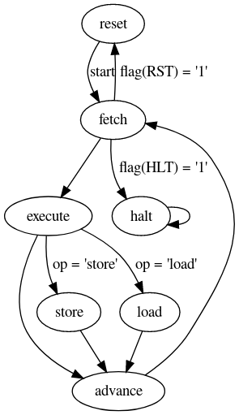

		                           ____   ___  ____  _  _                                     
		                          (  _ \ / __)(  _ \/ )( \                                    
		                           ) _ (( (__  ) __/) \/ (                                    
		                          (____/ \___)(__)  \____/                                    
		  __     ____  __  ____    ____  ____  ____  __   __   __       ___  ____  _  _       
		 / _\   (  _ \(  )(_  _)  / ___)(  __)(  _ \(  ) / _\ (  )     / __)(  _ \/ )( \      
		/    \   ) _ ( )(   )(    \___ \ ) _)  )   / )( /    \/ (_/\  ( (__  ) __/) \/ (      
		\_/\_/  (____/(__) (__)   (____/(____)(__\_)(__)\_/\_/\____/   \___)(__)  \____/

| Project   | Bit-Serial CPU in VHDL                 |
| --------- | -------------------------------------- |
| Author    | Richard James Howe                     |
| Copyright | 2019 Richard James Howe                |
| License   | MIT                                    |
| Email     | howe.r.j.89@gmail.com                  |
| Website   | <https://github.com/howerj/bit-serial> |

*Processing data one bit at a time, since 2019*.

## Introduction

This is a project for a [bit-serial CPU][], which is a CPU that has an architecture
which processes a single bit at a time instead of in parallel like a normal
CPU. This allows the CPU itself to be a lot smaller, the penalty is that it is
a lot slower. The CPU itself is called *bcpu*.

The CPU is incredibly basic, lacking support for features required to support
higher level programming (such as function calls). Instead such features can 
be emulated if they are needed. If such features are needed, or faster
throughput (whilst still remaining quite small) other [Soft-Core][] CPUs are
available, such as the [H2][]. 

To build the assembler and C based simulator for the project, you will need a C
compiler and 'make'. To build the [VHDL][] simulator, you will need [GHDL][]
installed.

The target [FPGA][] that the system is built for is a [Spartan-6][], for a
[Nexys 3][] development board. [Xilinx ISE 14.7][] was used to build the
project.

The following 'make' targets are available:

	make

By default the [VHDL][] test bench is built and simulated in [GHDL][]. This
requires that the assembler is build, to assemble the test program [bit.asm][]
into a file readable by the simulator.

	make run

This target builds the C based simulator/assembler, assembles the test program
and runs the simulator on the assembled program.

	make simulation synthesis implementation bitfile

This builds the project for the [FPGA][].

	make upload

This uploads the project to the [Nexys 3][] board. This requires that
'djtgcfg' is installed, which is a tool provided by [Digilent][].

	make documentation

This turns this 'readme.md' file into a HTML file.

	make clean

Cleans up the project.

## CPU Specification

A quick overview of the features *bcpu*:

* A 16/12-bit CPU
* Can address 4096 16-bit values of program memory.
* An accumulator design
* As it is a [bit serial CPU][] it processes data a bit at a time, the
processor stays in each state for 16 clock cycles. A single instruction is
fetched and executed in 51-68 ((16 + 1)\*3 to (16 + 1) \* 4) clock cycles.
* Has add-with-carry, subtract with borrow flag, rotate and shift left/right 
instructions.
* Lacks any kind of call stack, or registers.
* Has very little CPU state; 5 x 16 bit registers, a 4-bit register, 2 x 3-bit
  register, and 2 x 1-bit register.
* Takes up very little floor space and no dedicated resources (apart from a
Block RAM for the program memory) on the [FPGA][].

The CPU is self-contained within a single file, [bit.vhd][]. It communicates to
the rest of the system in the [FPGA][] via a serial interface. Whilst the CPU
can be customized via a [VHDL][] generic to be of an arbitrary width, the rest
of the document and the toolchain assume the width has been set to 16. 

There is a single state-machine which forms the heart of the CPU, it has seven
states; 'reset', 'fetch', 'execute', 'store', 'load', 'advance' and 'halt'.

Not shown in this diagram is the fact that all states can go back to the
'reset' state when an external reset signal is given.

Whilst the CPU could be described as a 16-bit CPU, a more accurate description
would be that it is a hybrid 16/12-bit CPU. All instructions are composed of a
4-bit command and a 12-bit operand (even if the operand is not used).

### Instruction Set

The flags register contains the following flags:

| Flag-Bit | Name        | Description                   |
| -------- | ----------- | ----------------------------- |
|    0     | carry       | Carry Flag                    |
|    1     | borrow      | Borrow/Under Flow             |
|    2     | zero        | Is accumulator zero?          |
|    3     | negative    | Is accumulator negative?      |
|    4     | Parity      | Parity of accumulator         |
|    5     | Rotate      | Rotate mode = 1, Shift = 0    |
|    6     | Reset       | Set to reset the CPU          |
|    7     | Halt        | Set to halt the CPU           |
|    8     | PCC         | Internal usage                |
|    9     | UT          | Internal usage                |
|  10-15   | Unused      | Unused bits                   |

Register Key:

* acc   - The accumulator, this is used to store the results of operations,
such as addition, or loading a value.
* pc    - The program counter, this is incremented after each instruction
is executed unless the instruction sets the program counter.
* flags - A 16-bit register containing 8-flags
* op    - A 12-bit operand which is part of every instruction.
* rotl  - rotate left, not through carry
* rotr  - rotate right, not through carry
* &lt;&lt; - shift left, not through carry
* &gt;&gt; - shift right, not through carry
* bitcount - a function returning the count of the number of set bits in a
value
* memory - the program and data memory, read/write.

The instruction set is as follows:

| Instruction | Registers / Flags Effected    | Description                       |
| ----------- | ----------------------------- | --------------------------------- |
|   OR        | acc <- acc OR op              | OR  with 12-bit immediate value   |
|   AND       | acc <- acc AND (op OR $F000)  | AND with 12-bit immediate value   |
|   XOR       | acc <- acc XOR op             | XOR with 12-bit immediate value   |
|   INVERT    | acc <- INVERT acc             | Bit-wise invert                   |
|   ADD       | acc <- acc + op + carry       | Add with 12-bit immediate value,  |
|             | carry <- set/clr              | Carry added in and set.           |
|   SUB       | acc <- (acc - op) - borrow    | Subtract with 12-bit immediate    |
|             | borrow <- set/clr             | value, borrow used and set/clr    |
|   LSHIFT    | if rotate flag set:           | Left rotate *OR* Left Shift by    |
|             | acc <- rotl(acc, bitcount(op) | bit-count of 12-bit operand.      |
|             | else                          | Rotate/Shift selected by CPU flag |
|             | acc <- acc << bitcount(op)    |                                   |
|   RSHIFT    | if rotate flag set:           | Right rotate *OR* Right Shift by  |
|             | acc <- rotr(acc, bitcount(op) | bit-count of 12-bit operand.      |
|             | else                          | Rotate/Shift selected by CPU flag |
|             | acc <- acc >> bitcount(op)    |                                   |
|   LOAD      | acc <- memory(op)             | Load memory location              |
|   STORE     | memory(op) <- acc             | Store to memory location          |
|   FLAGS     | acc <- flags, flags <- acc    | Exchange flags with accumulator   |
|   JUMP      | pc <- op                      | Unconditional Jump to 12-bit      |
|             |                               | Address                           |
|   JUMPZ     | if zero flag not set then:    | Conditional Jump, set Program     |
|             | pc <- op                      | Counter to 12-bit address only if |
|             |                               | accumulator is non-zero           |
|   Unused    |                               |                                   |
|   Unused    |                               |                                   |
|             |                               |                                   |

To connect the CPU up to the rest of the system you will need to understand the
signal timing for all of the *bcpu* input and output signals:

Some notes on the timing diagram, the 'cycle' field is for illustrative
purposes only. The text in the 'cycle' field has the following meaning:

* prev: The last bit of the previous execution state.
* init: The first bit of the current execution state, this is used to set up
  the current execution state.
* 0-15: The rest of the bits to be processed for the current execution state.
* next: The first bit of the next execution state.
* rest: The rest of the bits of the next execution states.

Other useful information:

* The Least Significant Bit is transmitted first input, output and the address.
* The output signal line goes to either an output register or an address
register depending on whether 'oe' or 'ae' is selected.
* Reads and writes never happen at the same time.
* All of the enable lines ('oe', 'ie', and 'ae') are held high for exactly
16-clock cycles. Prior to this, and after it, the line are guaranteed to return
to zero for at least one clock cycle. 

## Tool-Chain

The tool-chain is entirely contained within a single file, [bit.c][]. This
contains a simulator/debugger and an assembler for the CPU. It is capable of
producing files understandable by the [VHDL][] CPU as well, the generated file
is used for the [C][] simulation and the [VHDL][] simulation/synthesis.

The syntax of the assembler and the directives it provides are quite primitive.
The program itself is quite small (< 1000 LOC), so you can read it to
understand it and extend it yourself if you need to.

## To-Do

* Implement Memory mapped I/O in VHDL and in simulator
  - Add an I/O line, or allow the top four bits of the address to be set to
  a default value (use more flag bits?).
  - Add a timer
  - Implement a software only 9600 baud UART driver
  - Add input for switches
* Fill up instruction set (which instructions arithmetic instructions are optimal/easy to implement?)
* Implement in VHDL (along with a bit-parallel alternative - use the parallel
  version to test the equivalence with the bit-serial version)
* Document system (instruction set tables, and state machine diagrams, cycle timing)
* Make an assembler (done, need to improve it now)
* Port a simple, very cut down, Forth
* Do the program counter addition in parallel with the execution, or fetch
* Use a LFSR instead of a Program Counter? (see
  <https://news.ycombinator.com/item?id=11978900>)
* Add an interrupt request line

## References / Appendix

The state-machine diagram was made using [Graphviz][], and can be viewed and
edited immediately by copying the following text into [GraphvizOnline][].

	digraph bcpu {
		reset -> fetch [label="start"]
		fetch -> execute
		fetch -> reset  [label="flag(RST) = '1'"]
		fetch -> halt  [label="flag(HLT) = '1'"]
		execute -> advance
		execute -> store   [label="op = 'store'"]
		execute -> load   [label="op = 'load'"]
		store -> advance
		load -> advance
		advance -> fetch
		halt -> halt
	}

For timing diagrams, use [Wavedrom][] with the following text:

	{signal: [
	  {name: 'clk',   wave: 'pp...p...p...p...p..'},
	  {name: 'cycle', wave: '22222222222222222222', data: ['prev', 'init','0', '1', '2', '3', '4', '5', '6', '7', '8', '9', '10', '11', '12', '13', '14', '15', 'next', 'rest']},
	  {name: 'cmd',   wave: 'x2..................', data: ['HALT']},
	  {name: 'ie',    wave: 'x0..................'},
	  {name: 'oe',    wave: 'x0..................'},
	  {name: 'ae',    wave: 'x0..................'},
	  {name: 'o',     wave: 'x0..................'},
	  {name: 'i',     wave: 'x...................'},
	  {name: 'halt',  wave: 'x1..................'},
	  {},
	  
	  {name: 'clk',   wave: 'pp...p...p...p...p..'},
	  {name: 'cycle', wave: '22222222222222222222', data: ['prev', 'init','0', '1', '2', '3', '4', '5', '6', '7', '8', '9', '10', '11', '12', '13', '14', '15', 'next', 'rest']},
	  {name: 'cmd',   wave: 'x2................xx', data: ['ADVANCE']},
	  {name: 'ie',    wave: 'x0.................x'},
	  {name: 'oe',    wave: 'x0.................x'},
	  {name: 'ae',    wave: 'x01...............0x'},
	  {name: 'o',     wave: 'x0================0x', data: ['0', '1', '2', '3', '4', '5', '6', '7', '8', '9', '10', '11', 'F12', 'F13', 'F14', 'F15']},
	  {name: 'i',     wave: 'x.................xx'},
	  {name: 'halt',  wave: 'x0.................x'},
	  {},
	  
	  {name: 'clk',   wave: 'pp...p...p...p...p..'},
	  {name: 'cycle', wave: '22222222222222222222', data: ['prev', 'init','0', '1', '2', '3', '4', '5', '6', '7', '8', '9', '10', '11', '12', '13', '14', '15', 'next', 'rest']},      
	  {name: 'cmd',   wave: 'x2................xx', data: ['LOAD']},
	  {name: 'ie',    wave: 'x01...............0x'},
	  {name: 'oe',    wave: 'x0.................x'},
	  {name: 'ae',    wave: 'x0.................x'},
	  {name: 'o',     wave: 'x0.................x'},
	  {name: 'i',     wave: 'x.================xx', data: ['0', '1', '2', '3', '4', '5', '6', '7', '8', '9', '10', '11', '12', '13', '14', '15']},
	  {name: 'halt',  wave: 'x0.................x'},
	  {}, 
	  
	  {name: 'clk',   wave: 'pp...p...p...p...p..'},
	  {name: 'cycle', wave: '22222222222222222222', data: ['prev', 'init','0', '1', '2', '3', '4', '5', '6', '7', '8', '9', '10', '11', '12', '13', '14', '15', 'next', 'rest']},
	  {name: 'cmd',   wave: 'x2................xx', data: ['STORE']},
	  {name: 'ie',    wave: 'x0.................x'},
	  {name: 'oe',    wave: 'x01...............0x'},
	  {name: 'ae',    wave: 'x0.................x'},
	  {name: 'o',     wave: 'x0================0x', data: ['0', '1', '2', '3', '4', '5', '6', '7', '8', '9', '10', '11', '12', '13', '14', '15']},
	  {name: 'i',     wave: 'x.................xx'},
	  {name: 'halt',  wave: 'x0.................x'},
	  {},
	  
	  {name: 'clk',   wave: 'pp...p...p...p...p..'},
	  {name: 'cycle', wave: '22222222222222222222', data: ['prev', 'init','0', '1', '2', '3', '4', '5', '6', '7', '8', '9', '10', '11', '12', '13', '14', '15', 'next', 'rest']},
	  {name: 'cmd',   wave: 'x2................xx', data: ['EXECUTE: LOAD, STORE, JUMP, JUMPZ']},
	  {name: 'ie',    wave: 'x0.................x'},
	  {name: 'oe',    wave: 'x0.................x'},
	  {name: 'ae',    wave: 'x01...............0x'},
	  {name: 'o',     wave: 'x0================0x', data: ['0', '1', '2', '3', '4', '5', '6', '7', '8', '9', '10', '11', 'F12', 'F13', 'F14', 'F15']},
	  {name: 'i',     wave: 'x.................xx'},
	  {name: 'halt',  wave: 'x0.................x'},
	  {},
	  
	  {name: 'clk',   wave: 'pp...p...p...p...p..'},
	  {name: 'cycle', wave: '22222222222222222222', data: ['prev', 'init','0', '1', '2', '3', '4', '5', '6', '7', '8', '9', '10', '11', '12', '13', '14', '15', 'next', 'rest']},      
	  {name: 'cmd',   wave: 'x2................xx', data: ['EXECUTE: NORMAL INSTRUCTION']},
	  {name: 'ie',    wave: 'x0.................x'},
	  {name: 'oe',    wave: 'x0.................x'},
	  {name: 'ae',    wave: 'x0.................x'},
	  {name: 'o',     wave: 'x0.................x'},
	  {name: 'i',     wave: 'x.................xx'},
	  {name: 'halt',  wave: 'x0.................x'},
	  {},
	  
	  {name: 'clk',   wave: 'pp...p...p...p...p..'},
	  {name: 'cycle', wave: '22222222222222222222', data: ['prev', 'init','0', '1', '2', '3', '4', '5', '6', '7', '8', '9', '10', '11', '12', '13', '14', '15', 'next', 'rest']},
	  {name: 'cmd',   wave: 'x2................xx', data: ['FETCH']},
	  {name: 'ie',    wave: 'x01...............0x'},
	  {name: 'oe',    wave: 'x0.................x'},
	  {name: 'ae',    wave: 'x0.................x'},
	  {name: 'o',     wave: 'x0.................x'},
	  {name: 'i',     wave: 'x.================xx', data: ['0', '1', '2', '3', '4', '5', '6', '7', '8', '9', '10', '11', '12', '13', '14', '15']},
	  {name: 'halt',  wave: 'x0.................x'},
	  {},
	  
	  {name: 'clk',   wave: 'pp...p...p...p...p..'},
	  {name: 'cycle', wave: '22222222222222222222', data: ['prev', 'init','0', '1', '2', '3', '4', '5', '6', '7', '8', '9', '10', '11', '12', '13', '14', '15', 'next', 'rest']},
	  {name: 'cmd',   wave: 'x2................xx', data: ['RESET']},
	  {name: 'ie',    wave: 'x0.................x'},
	  {name: 'oe',    wave: 'x01...............0x'},
	  {name: 'ae',    wave: 'x01...............0x'},
	  {name: 'o',     wave: 'x0.................x'},
	  {name: 'i',     wave: 'x.................xx'},  
	  {name: 'halt',  wave: 'x0.................x'},
	  {},
	  
	]}

That's all folks!

[H2]: https://github.com/howerj/forth-cpu
[Soft-Counter]: https://en.wikipedia.org/wiki/Soft_microprocessor#Core_comparison
[bit-serial CPU]: https://en.wikipedia.org/wiki/Bit-serial_architecture
[VHDL]: https://en.wikipedia.org/wiki/VHDL
[GHDL]: http://ghdl.free.fr/
[Graphviz]: https://graphviz.org/
[GraphvizOnline]: https://dreampuf.github.io/GraphvizOnline
[bit.vhd]: bit.vhd
[bit.c]: bit.c
[FPGA]: https://en.wikipedia.org/wiki/Field-programmable_gate_array
[Wavedrom]: https://wavedrom.com/editor.html
[Cool ASCII Text]: http://www.patorjk.com/software/taag
[Xilinx ISE 14.7]: https://www.xilinx.com/products/design-tools/ise-design-suite/ise-webpack.html
[Nexys 3]: https://store.digilentinc.com/nexys-3-spartan-6-fpga-trainer-board-limited-time-see-nexys4-ddr/
[Spartan-6]: https://www.xilinx.com/products/silicon-devices/fpga/spartan-6.html
[bit.asm]: bit.asm
[Digilent]: https://store.digilentinc.com/

